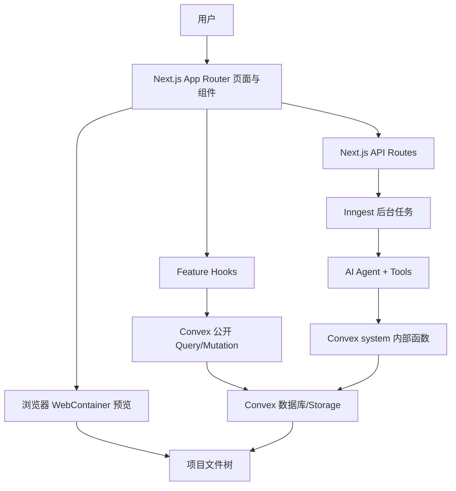
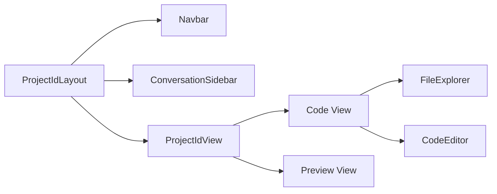
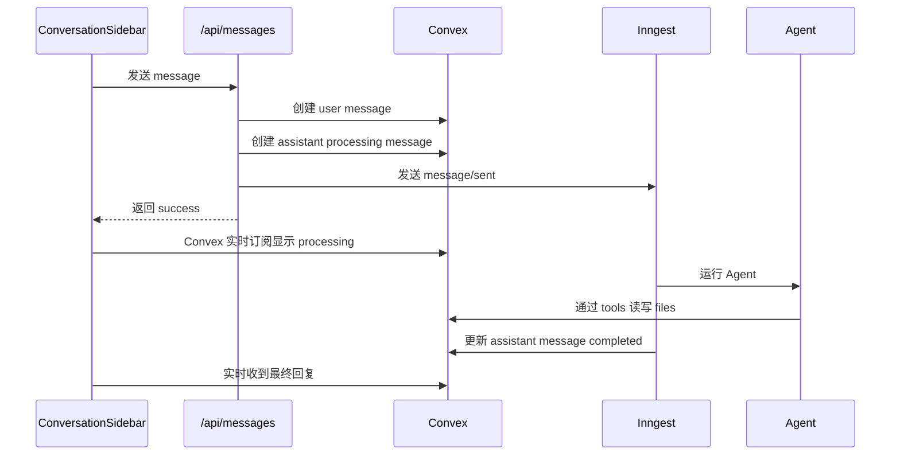

# Polaris 项目架构设计讲解

这份文档讲 Polaris 这个项目的整体架构。重点不是“某个文件写了什么”，而是解释它为什么这样设计：它要解决什么问题，模块之间为什么这样分层，数据为什么这样流动。

## 1. 先判断这个项目是什么类型

从代码结构看，Polaris 不是普通 CRUD 管理后台，也不是单纯聊天应用。它更像一个“AI 驱动的在线代码工作台”：

- 用户可以创建或导入项目。
- 项目里有文件树和代码编辑器。
- 用户可以和 AI 对话，让 AI 读取、创建、修改项目文件。
- 项目可以在浏览器里通过 WebContainer 运行预览。
- 项目可以从 GitHub 导入，也可以导出到 GitHub。

所以它的核心架构目标是：

> 把“项目文件系统、AI 对话、代码编辑、运行预览、GitHub 同步”组织到同一个项目上下文里。

这个判断很重要，因为它解释了后面很多设计选择。

普通聊天应用只需要 messages；普通代码编辑器只需要 files；普通项目管理系统只需要 projects。但 Polaris 需要让这些东西互相联动，所以它的架构围绕 `projectId` 展开。

## 2. 总体分层

项目大体分成这几层：



可以理解为：

- `src/app`：路由入口和 API 入口。
- `src/features/*`：业务功能模块。
- `src/components/*`：通用 UI 和 AI UI 组件。
- `convex/*`：数据库 schema、查询和变更。
- `src/features/*/inngest/*`：后台长任务。
- `src/lib/*`：外部服务客户端或工具。

这是一种按“业务能力 feature”组织的架构，而不是按“components/services/utils”横向堆文件。

为什么这样设计？

因为这个项目的功能边界很清楚：projects、editor、preview、conversations、auth。按 feature 组织能让你在维护某个业务域时少跨目录。例如编辑器相关代码都在 `src/features/editor`，预览相关代码都在 `src/features/preview`。

## 3. 全局入口：认证、数据和主题先包起来

入口文件：

- `src/app/layout.tsx`
- `src/components/providers.tsx`

`layout.tsx` 负责加载字体、全局样式、toast，然后把页面包进 `Providers`：

```tsx
<Providers>
  {children}
  <Toaster />
</Providers>
```

`Providers` 里做了三件核心事情：

```tsx
<ClerkProvider>
  <ConvexProviderWithClerk client={convex} useAuth={useAuth}>
    <ThemeProvider ...>
      <Authenticated>{children}</Authenticated>
      <Unauthenticated><UnauthenticatedView /></Unauthenticated>
      <AuthLoading><AuthLoadingView /></AuthLoading>
    </ThemeProvider>
  </ConvexProviderWithClerk>
</ClerkProvider>
```

这个设计的思考是：

1. 整个应用都需要登录态，所以 Clerk 放全局。
2. 前端数据读写依赖 Convex，并且 Convex 需要知道 Clerk 用户身份，所以用 `ConvexProviderWithClerk`。
3. 页面不应该到处判断是否登录，而是全局统一处理 `Authenticated`、`Unauthenticated`、`AuthLoading`。
4. 主题也是全局行为，放在 provider 层统一控制。

这样业务组件就可以默认假设“进来的用户已经登录”，不用每个页面重复写认证 UI。

## 4. 路由设计：首页是项目入口，项目页是工作台

首页：

- `src/app/page.tsx`
- `src/features/projects/components/projects-view.tsx`

首页直接渲染：

```tsx
return <ProjectsView />;
```

`ProjectsView` 提供三个入口：

- 新建项目。
- 导入 GitHub。
- 查看/搜索已有项目。

项目详情页：

- `src/app/projects/[projectId]/layout.tsx`
- `src/app/projects/[projectId]/page.tsx`
- `src/features/projects/components/project-id-layout.tsx`
- `src/features/projects/components/project-id-view.tsx`

`[projectId]/layout.tsx` 外层渲染项目级布局：

```tsx
<ProjectIdLayout projectId={projectId}>
  {children}
</ProjectIdLayout>
```

`[projectId]/page.tsx` 渲染项目主视图：

```tsx
<ProjectIdView projectId={projectId} />
```

这里的设计重点是：项目页不是一个单页面，而是一个工作台布局。

外层 `ProjectIdLayout`：

- 顶部 Navbar。
- 左侧 ConversationSidebar。
- 右侧项目主区域。

内层 `ProjectIdView`：

- Code tab。
- Preview tab。
- Code tab 内部又分文件树和编辑器。

结构可以这样理解：



为什么要这样设计？

因为 AI 对话不是孤立聊天，它要伴随整个项目存在。用户一边和 AI 说需求，一边看文件，一边预览运行结果。所以会话侧栏放在项目布局外层，而不是放在 editor 内部。

Code 和 Preview 则是同一个项目主区域里的两种视图，所以放在 `ProjectIdView` 内部切换。

## 5. 数据模型：一切围绕项目展开

数据库 schema 在 `convex/schema.ts`。

核心表有四张：

```ts
projects
files
conversations
messages
```

### 5.1 projects

```ts
projects: defineTable({
  name: v.string(),
  ownerId: v.string(),
  updatedAt: v.number(),
  importStatus: v.optional(...),
  exportStatus: v.optional(...),
  exportRepoUrl: v.optional(v.string()),
  settings: v.optional(
    v.object({
      installCommand: v.optional(v.string()),
      devCommand: v.optional(v.string()),
    })
  ),
}).index("by_owner", ["ownerId"])
```

`projects` 是顶层聚合根。它记录：

- 项目归属：`ownerId`
- 更新时间：`updatedAt`
- GitHub 导入导出状态
- 预览运行命令配置

为什么项目表要有 `settings`？

因为 WebContainer 运行项目时需要知道安装命令和启动命令。不同项目可能是 `npm run dev`、`pnpm dev` 或其他命令，所以它属于项目配置。

### 5.2 files

```ts
files: defineTable({
  projectId: v.id("projects"),
  parentId: v.optional(v.id("files")),
  name: v.string(),
  type: v.union(v.literal("file"), v.literal("folder")),
  content: v.optional(v.string()),
  storageId: v.optional(v.id("_storage")),
  updatedAt: v.number(),
})
```

文件系统用一张 `files` 表表达。

关键设计：

- `projectId` 表示文件属于哪个项目。
- `parentId` 表示文件夹层级。
- `type` 区分文件和文件夹。
- 文本文件用 `content`。
- 二进制文件用 `storageId` 存到 Convex Storage。

为什么不用一个嵌套 JSON 存整棵文件树？

因为文件要被单独查询、更新、重命名、删除，也要被 AI tool 单独读写。用扁平表 + `parentId` 更适合：

- 局部更新单个文件。
- 查询某个文件夹内容。
- 给文件生成稳定 ID。
- AI 工具可以通过 fileId 精准读写。
- GitHub 导入时可以逐个创建文件。

### 5.3 conversations 和 messages

```ts
conversations: defineTable({
  projectId: v.id("projects"),
  title: v.string(),
  updatedAt: v.number(),
})

messages: defineTable({
  conversationId: v.id("conversations"),
  projectId: v.id("projects"),
  role: v.union(v.literal("user"), v.literal("assistant")),
  content: v.string(),
  status: v.optional(
    v.union(
      v.literal("processing"),
      v.literal("completed"),
      v.literal("cancelled")
    )
  ),
})
```

会话属于项目，消息同时记录 `conversationId` 和 `projectId`。

为什么 message 里已经有 `conversationId`，还要冗余 `projectId`？

因为有些查询关心项目级状态，比如“这个项目有没有正在 processing 的消息”：

```ts
.index("by_project_status", ["projectId", "status"])
```

如果不冗余 `projectId`，就要先查所有 conversations 再查 messages，复杂且低效。这里的冗余是为了项目级状态查询。

## 6. Convex 公开函数：用户操作必须校验 owner

公开查询/变更主要在：

- `convex/projects.ts`
- `convex/files.ts`
- `convex/conversations.ts`

典型模式是：

```ts
const identity = await verifyAuth(ctx);
const project = await ctx.db.get("projects", projectId);

if (!project) {
  throw new Error("Project not found");
}

if (project.ownerId !== identity.subject) {
  throw new Error("Unauthorized");
}
```

这个设计说明：Convex 是真正的数据权限边界。

即使前端隐藏了按钮，服务端 mutation/query 还是必须检查：

- 用户是否登录。
- 项目是否存在。
- 当前用户是不是 owner。

为什么每个文件操作都要查 project owner？

因为文件本身没有 `ownerId`，它通过 `projectId` 继承权限。这样避免每个 file 都重复 owner 字段，同时权限模型更统一：

> 能访问项目，才可以访问项目下的文件、会话和消息。

## 7. Convex system 内部函数：给后台任务和 Agent 用

`convex/system.ts` 是一组内部访问函数。

它不使用 Clerk 用户登录态，而是要求传入：

```ts
internalKey: v.string()
```

然后校验：

```ts
const validateInternalKey = (key: string) => {
  const internalKey = process.env.POLARIS_CONVEX_INTERNAL_KEY;

  if (key !== internalKey) {
    throw new Error("Invalid internal key");
  }
};
```

为什么要有 system 层？

因为 Inngest 后台任务和 AI Agent 不在用户浏览器请求上下文里运行，它们没有 Clerk session。但是它们需要创建消息、改文件、导入导出 GitHub。于是项目设计了一个服务端内部入口：

- 前端用户操作走公开 Convex 函数，校验 Clerk。
- 后台任务走 `system.ts`，校验 internal key。
- 两者最终操作同一套数据表。

这样既能支持后台自动化，又不会把内部写能力暴露给普通前端。

## 8. API Routes 的角色：薄入口，不做重活

项目里很多 API Route 不直接完成全部业务，而是做“校验 + 写入初始状态 + 触发后台任务”。

典型例子：`src/app/api/messages/route.ts`。

流程是：

1. 校验 Clerk 登录。
2. 查询 conversation，拿到 projectId。
3. 找出项目中正在 processing 的旧消息并取消。
4. 创建用户消息。
5. 创建 assistant 占位消息，状态为 `processing`。
6. 发送 Inngest 事件 `message/sent`。
7. 立即返回。

代码形态：

```ts
await convex.mutation(api.system.createMessage, {
  role: "user",
  content: message,
});

const assistantMessageId = await convex.mutation(
  api.system.createMessage,
  {
    role: "assistant",
    content: "",
    status: "processing",
  }
);

await inngest.send({
  name: "message/sent",
  data: {
    messageId: assistantMessageId,
    conversationId,
    projectId,
    message,
  },
});
```

为什么不在 API Route 里直接跑 AI？

因为 AI 编程任务可能很慢，可能需要多轮 tool call，还可能要取消、失败重试、记录步骤。HTTP 请求不适合承担这种长任务。

所以 API Route 只负责“接单”，Inngest 负责“干活”。

这是一种很重要的架构思路：

> 用户请求要短，长任务要后台化，状态要持久化。

## 9. Inngest：长任务编排层

后台函数注册在：

- `src/app/api/inngest/route.ts`
- `src/features/conversations/inngest/process-message.ts`
- `src/features/projects/inngest/import-github-repo.ts`
- `src/features/projects/inngest/export-to-github.ts`

`route.ts` 把函数交给 Inngest：

```ts
export const { GET, POST, PUT } = serve({
  client: inngest,
  functions: [
    processMessage,
    importGithubRepo,
    exportToGithub,
  ],
});
```

为什么使用 Inngest？

这个项目有三类天然适合后台编排的任务：

1. AI Agent 处理消息：时间长，有 tool call，可取消。
2. GitHub 导入：要拉 tree、创建文件、处理二进制。
3. GitHub 导出：要创建 repo、blob、tree、commit。

这些任务都不是简单的同步接口。Inngest 的 `step.run` 可以把长流程拆成步骤，失败时更容易定位和恢复。

## 10. AI Agent 架构：会话只是入口，文件工具才是能力

核心文件：

- `src/features/conversations/inngest/process-message.ts`
- `src/features/conversations/inngest/tools/*`

`processMessage` 接收 `message/sent` 事件后：

1. 查询 conversation。
2. 查询最近 10 条消息作为上下文。
3. 如果会话标题还是默认值，先用小模型生成标题。
4. 创建 coding agent。
5. 给 agent 挂载文件工具。
6. 运行 agent network。
7. 把最终回复写回 assistant message。

Agent 的工具包括：

```ts
tools: [
  createListFilesTool({ internalKey, projectId }),
  createReadFilesTool({ internalKey }),
  createUpdateFileTool({ internalKey }),
  createCreateFilesTool({ projectId, internalKey }),
  createCreateFolderTool({ projectId, internalKey }),
  createRenameFileTool({ internalKey }),
  createDeleteFilesTool({ internalKey }),
  createScrapeUrlsTool(),
]
```

为什么要用 tools，而不是把整个项目代码一次性塞给模型？

因为项目文件可能很多，全部塞进 prompt 会：

- 超出上下文。
- 成本高。
- 让模型难以定位。
- 修改结果难以结构化落库。

用 tool 的思路是：

- 先 `listFiles` 理解文件结构。
- 按需 `readFiles`。
- 精准 `updateFile`、`createFiles`、`renameFile`。

这类似真实开发者的工作方式：先看目录，再读相关文件，再做修改。

## 11. 消息状态设计：processing / completed / cancelled

messages 表里有：

```ts
status: "processing" | "completed" | "cancelled"
```

前端 `ConversationSidebar` 根据状态渲染：

- `processing`：显示 Thinking。
- `cancelled`：显示 Request cancelled。
- `completed`：显示正常消息内容。

为什么 assistant message 要先创建空占位？

因为这样 UI 可以立即响应：

1. 用户提交消息后，马上看到自己的消息。
2. 马上看到 assistant 的 processing 状态。
3. 后台完成后再把同一条 assistant message 更新成最终内容。

如果等 AI 完成后再创建 assistant message，用户会觉得请求没反应，也不好取消。

取消逻辑也是靠状态和事件：

- API 找到 processing messages。
- 发 `message/cancel`。
- 把 message 状态改成 `cancelled`。
- Inngest 函数通过 `cancelOn` 停止对应任务。

## 12. 文件系统设计：同一份数据给编辑器、Agent、预览、GitHub 用

项目文件保存在 Convex `files` 表中。这份数据同时服务四个场景：

1. 文件树 UI：`FileExplorer`
2. 编辑器：`CodeEditor`
3. AI Agent tools：读写文件
4. WebContainer 预览：转换成虚拟文件系统
5. GitHub 导入导出：和仓库 tree 互转

这就是为什么文件系统被设计成项目的核心数据结构。

扁平文件表可以转换成不同视图：

- 文件树 UI 需要父子结构。
- WebContainer 需要嵌套 `FileSystemTree`。
- GitHub export 需要完整路径。
- Agent 需要 ID 和内容。

例如 WebContainer 转换逻辑在 `src/features/preview/utils/file-tree.ts`：

```ts
export const buildFileTree = (files: FileDoc[]): FileSystemTree => {
  const tree: FileSystemTree = {};
  const filesMap = new Map(files.map((f) => [f._id, f]));

  const getPath = (file: FileDoc): string[] => {
    const parts: string[] = [file.name];
    let parentId = file.parentId;

    while (parentId) {
      const parent = filesMap.get(parentId);
      if (!parent) break;
      parts.unshift(parent.name);
      parentId = parent.parentId;
    }

    return parts;
  };

  // 按路径构建嵌套 tree
};
```

这个设计体现了一个架构原则：

> 数据库保存规范化的核心模型，使用场景需要什么形状，就在边界处转换。

## 13. 编辑器架构：React 外壳 + CodeMirror 内核

编辑器主要在：

- `src/features/editor/components/editor-view.tsx`
- `src/features/editor/components/code-editor.tsx`
- `src/features/editor/extensions/*`

外层 `EditorView` 负责：

- 根据当前 active tab 找到文件。
- 判断是文本还是二进制。
- 给 `CodeEditor` 传入文件名和内容。
- 对保存做 1500ms 防抖。

```tsx
<CodeEditor
  key={activeFile._id}
  fileName={activeFile.name}
  initialValue={activeFile.content}
  onChange={(content) => {
    timeoutRef.current = setTimeout(() => {
      updateFile({ id: activeFile._id, content });
    }, DEBOUNCE_MS);
  }}
/>
```

内层 `CodeEditor` 负责创建 CodeMirror：

```ts
new EditorView({
  doc: initialValue,
  parent: editorRef.current,
  extensions: [
    oneDark,
    customTheme,
    customSetup,
    languageExtension,
    suggestion(fileName),
    quickEdit(fileName),
    selectionTooltip(),
    ...
  ],
});
```

为什么这样拆？

因为 React 适合管理“哪个文件被打开、何时保存、是否显示二进制提示”；CodeMirror 适合管理“编辑器输入、选区、快捷键、插件、语法高亮”。

也就是说：

- React 管业务状态。
- CodeMirror 管编辑行为。

## 14. 预览架构：浏览器内运行项目

预览主要在：

- `src/features/projects/components/preview-view.tsx`
- `src/features/preview/hooks/use-webcontainer.ts`
- `src/features/preview/utils/file-tree.ts`

`PreviewView` 负责 UI：

- 顶部地址栏和按钮。
- iframe 显示预览 URL。
- terminal 输出。
- 设置安装和启动命令。

`useWebContainer` 负责真正运行：

1. 读取项目 files。
2. 启动 WebContainer。
3. 把 Convex 文件树 mount 进去。
4. 执行 install command。
5. 执行 dev command。
6. 监听 `server-ready` 得到 preview URL。
7. 文件变化后写入 WebContainer 文件系统，触发热更新。

关键逻辑：

```ts
const container = await getWebContainer();
const fileTree = buildFileTree(files);
await container.mount(fileTree);

const installProcess = await container.spawn(installBin, installArgs);
const devProcess = await container.spawn(devBin, devArgs);

container.on("server-ready", (_port, url) => {
  setPreviewUrl(url);
  setStatus("running");
});
```

为什么 WebContainer 用 singleton？

文件里有：

```ts
let webcontainerInstance: WebContainer | null = null;
let bootPromise: Promise<WebContainer> | null = null;
```

WebContainer 启动成本高，而且浏览器环境通常不适合同时启动多个完整容器。singleton 可以避免重复 boot，降低资源消耗。

为什么 Preview 不是服务端运行？

因为这个项目的目标是在线即时预览用户项目。WebContainer 让代码在浏览器沙箱里运行，不需要服务端为每个用户开容器，架构更轻。

## 15. GitHub 导入：仓库 tree 转项目 files

GitHub 导入由 Inngest 后台函数处理：

- `src/features/projects/inngest/import-github-repo.ts`

流程：

1. 清理项目已有文件。
2. 获取 GitHub repo tree。
3. 先按深度创建文件夹，保证父文件夹先存在。
4. 遍历 blob 文件。
5. 判断是否二进制。
6. 文本文件写入 `content`。
7. 二进制文件上传 Convex Storage，写入 `storageId`。
8. 更新 import status。

为什么文件夹要按深度排序？

因为创建子文件夹时需要 parentId。必须先有父文件夹 ID，才能创建子级。

代码中注释已经说明：

```ts
// Input:  [{ path: "src/components" }, { path: "src" }]
// Output: [{ path: "src" }, { path: "src/components" }]
```

为什么二进制文件要单独存 Storage？

因为 `content` 是字符串，只适合文本。图片、字体、压缩包等二进制内容不适合塞进数据库字段。用 Storage 可以减少数据库压力，也方便之后生成 URL。

## 16. GitHub 导出：项目 files 转 Git tree

GitHub 导出在：

- `src/features/projects/inngest/export-to-github.ts`

流程：

1. 设置项目 `exportStatus = "exporting"`。
2. 创建 GitHub repo。
3. 等待 GitHub 初始化 main 分支。
4. 查询项目所有文件和二进制文件 URL。
5. 根据 `parentId` 还原完整路径。
6. 为每个文件创建 Git blob。
7. 创建 Git tree。
8. 创建 commit。
9. 更新 main 分支 ref。
10. 设置 `exportStatus = "completed"` 和 repo URL。

为什么不用 GitHub 的普通 Contents API 一个个上传？

这里使用底层 Git API：blob -> tree -> commit -> ref。好处是可以把所有文件作为一次 commit 提交，而不是每个文件一次提交。对项目导出更干净，也更接近 Git 的数据模型。

## 17. Hooks 层：组件不直接碰 Convex API 细节

项目在 feature 里封装 hooks：

- `src/features/projects/hooks/use-projects.ts`
- `src/features/projects/hooks/use-files.ts`
- `src/features/conversations/hooks/use-conversations.ts`

例如：

```ts
export const useFiles = (projectId: Id<"projects"> | null) => {
  return useQuery(api.files.getFiles, projectId ? { projectId } : "skip");
};

export const useUpdateFile = () => {
  return useMutation(api.files.updateFile);
};
```

为什么要封装？

因为组件应该表达业务意图，而不是到处写 `useQuery(api.files.getFiles, ...)`。封装后：

- 组件更干净。
- 可以统一处理 `skip`。
- 可以加 optimistic update。
- Convex API 改名时影响范围更小。

例如创建文件使用 optimistic update：

```ts
useMutation(api.files.createFile).withOptimisticUpdate(...)
```

这让文件创建后 UI 可以先显示结果，不用等服务器返回，交互更顺。

## 18. UI 组织：业务组件和通用组件分离

通用 UI 在：

- `src/components/ui/*`
- `src/components/ai-elements/*`

业务 UI 在：

- `src/features/projects/components/*`
- `src/features/editor/components/*`
- `src/features/conversations/components/*`
- `src/features/preview/components/*`

为什么这样拆？

通用组件不应该知道项目业务，比如 Button、Dialog、PromptInput、Message 这类组件可以复用。

业务组件知道 projectId、conversationId、fileId，所以放在 feature 内部。

这能避免通用组件越来越耦合业务，也能让业务目录更自包含。

## 19. 状态管理：服务端状态、局部状态、客户端 store 分开

项目里有三类状态。

### 19.1 服务端状态：Convex

项目、文件、会话、消息都存在 Convex。

原因是这些状态需要：

- 持久化。
- 多组件共享。
- 后台任务读写。
- 实时更新。

### 19.2 局部 UI 状态：useState

例如：

- 当前 Code/Preview tab。
- 是否打开导入弹窗。
- 是否显示 terminal。

这些状态只影响当前组件，用 `useState` 就够了。

### 19.3 客户端编辑器 tab 状态：Zustand

`src/features/editor/store/use-editor-store.ts` 管理：

- 每个 project 打开的 tabs。
- 当前 active tab。
- preview tab。

为什么不用 Convex 存这个？

因为打开了哪些 tab 更像用户当前浏览器会话里的 UI 状态，不一定需要持久化到数据库。用 Zustand 更轻，也不会频繁写服务端。

## 20. 为什么整体采用“事件驱动 + 实时数据”的组合

这个项目有一个很明显的架构组合：

- Convex 负责实时数据和持久化。
- Inngest 负责后台事件和长任务。
- Next API Routes 负责接收用户意图。
- 前端通过 Convex hooks 自动感知状态变化。

例如发送消息：



为什么这个组合适合 Polaris？

因为用户需要看到即时状态，而 AI 和 GitHub 任务又不能阻塞请求。Convex 的实时更新刚好让后台任务的结果自然反映到 UI。

## 21. 架构里的关键取舍

### 21.1 选择 Convex 而不是传统 REST + SQL

项目大量使用实时查询和 mutation。Convex 让前端 hooks 直接订阅数据，减少手动缓存和刷新逻辑。

适合点：

- 文件列表实时更新。
- AI 消息状态实时更新。
- 项目导入导出状态实时更新。

代价是：

- 数据访问强绑定 Convex。
- 后台任务也要通过 Convex client 和 internal key 操作数据。

### 21.2 选择后台 Agent 而不是同步 AI API

适合点：

- 编程任务耗时长。
- 需要多轮工具调用。
- 需要取消。
- 需要失败处理。

代价是：

- 架构多一层 Inngest。
- 消息状态要设计清楚。
- system 内部函数要维护。

### 21.3 选择扁平 files 表而不是嵌套文件树

适合点：

- 单文件更新简单。
- parentId 表达层级灵活。
- Agent tool 可以按 fileId 操作。
- GitHub import/export 易转换。

代价是：

- 需要在 UI、WebContainer、GitHub export 边界处还原路径。
- 删除文件夹需要递归处理。

### 21.4 选择 WebContainer 而不是服务端容器

适合点：

- 不需要后端为每个项目启动容器。
- 浏览器内即时预览。
- 文件变化可以直接写入容器 FS。

代价是：

- 依赖浏览器能力。
- 对命令和项目类型有要求。
- 大项目资源消耗可能明显。

## 22. 一条完整业务链路：从“新建项目 prompt”到代码预览

以用户输入 prompt 创建项目为例：

1. 用户在 `NewProjectDialog` 输入需求。
2. 前端请求 `/api/projects/create-with-prompt`。
3. API 校验登录。
4. API 通过 `system.createProjectWithConversation` 创建项目和会话。
5. API 创建 user message。
6. API 创建 assistant processing message。
7. API 发送 Inngest `message/sent`。
8. 前端进入项目页。
9. `ConversationSidebar` 通过 Convex 看到 processing。
10. Inngest `processMessage` 创建 coding agent。
11. Agent 使用 create/read/update file tools 生成项目文件。
12. 文件写入 Convex `files` 表。
13. `FileExplorer` 和 `EditorView` 实时看到文件。
14. 用户切到 Preview。
15. `useWebContainer` 把 files 转成 WebContainer 文件树。
16. 执行安装和启动命令。
17. iframe 显示预览。

这条链路体现了项目的核心设计：

> 用户意图进入会话，Agent 把意图变成文件变化，文件变化又驱动编辑器和预览。

## 23. 如果你要继续扩展，应该顺着哪些边界加

### 23.1 新增一种 AI 工具

放在：

```txt
src/features/conversations/inngest/tools/
```

然后在 `process-message.ts` 的 `tools` 数组注册。

如果工具需要读写数据库，优先在 `convex/system.ts` 加内部函数。

### 23.2 新增一种项目级后台任务

放在对应 feature：

```txt
src/features/projects/inngest/
```

然后在：

```txt
src/app/api/inngest/route.ts
```

注册函数。

### 23.3 新增前端业务能力

按 feature 建目录：

```txt
src/features/xxx/components
src/features/xxx/hooks
```

通用 UI 才放 `src/components/ui`。

### 23.4 新增数据库能力

先判断是用户公开操作还是后台内部操作：

- 用户操作：加到 `convex/projects.ts`、`convex/files.ts` 等公开模块，并校验 owner。
- 后台操作：加到 `convex/system.ts`，用 internal key。

## 24. 总结：这个架构的核心思想

Polaris 的架构不是随便堆功能，而是围绕一个中心问题设计：

> 如何让用户、AI、编辑器、预览环境和 GitHub 都围绕同一份项目文件系统协作？

它的答案是：

- 用 `projects` 做聚合根。
- 用 Convex 保存项目、文件、会话、消息，并提供实时更新。
- 用 feature 目录组织业务边界。
- 用 Next API Routes 接收用户请求，但不承担长任务。
- 用 Inngest 编排 AI 和 GitHub 这类长流程。
- 用 Agent tools 把 AI 能力限制在明确的文件操作上。
- 用 WebContainer 在浏览器中运行项目预览。
- 用 system 内部函数隔离后台写权限。

如果用一句话记住：

> 前端负责呈现和交互，Convex 负责实时项目状态，Inngest 负责长任务，Agent 通过工具修改文件，WebContainer 用同一份文件运行预览。

